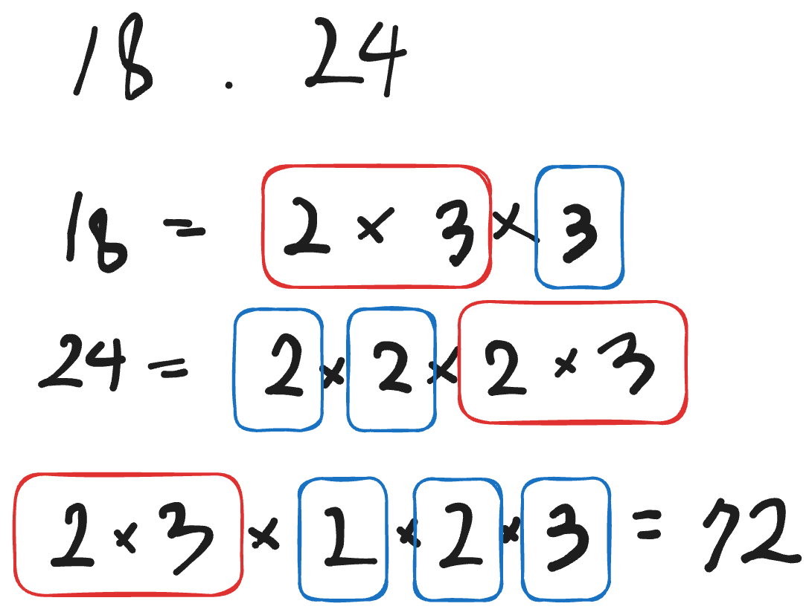
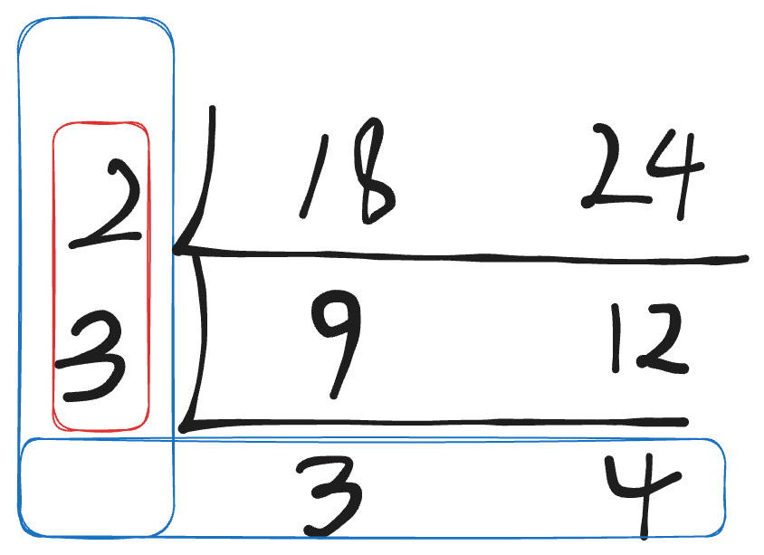

# TIL Template

## 날짜: 2025-01-26

### 🔔스크럼

### 📖Today I Learned
## 최대 공약수(GCD)와 최소 공배수(LCM)
### 가장 작은 수들의 곱으로 구하는 방법
18과 24로 드는 예시

- 겹치는 부분인 2 * 3인 6이 최대 공약수
- 6을 제외한 나머지 수를 곱해준 72가 최소 공배수
### 공약수로 나누며 구하는 방법

- 해당 공약수들로 18과 24가 더이상 나누어지지 않을 때까지 진행
- 나누는 데 사용된 2와 3을 곱한 6이 최대 공약수
- 나누는 데 사용한 수 * 더 이상 나눌 수 없는 수들 = 최소 공배수
### 유클리드 호제법
GCD와 LCM 개념의 문제를 풀 때 가장 많이 사용되는 알고리즘
1. 두 수 중 큰 수를 작은 수로 나눔.
2. 나머지가 0이면 작은 수가 최대 공약수가 됨
3. 나머지가 0이 아니면 작은 수가 큰 수가 되고, 나머지를 작은 수로 대체하고 1단계로 돌아감
<br>ex) 510과 210 
510을 210으로 나눕니다. 나머지는 90입니다. 510 = 210 * 2 + 90
210을 90으로 나눕니다. 나머지는 30입니다. 210 = 90 * 2 + 30
90을 30으로 나눕니다. 나머지는 0입니다. 90 = 30 * 3 + 0
나머지가 0이므로 최대공약수는 30입니다.
510 * 210 / 30 = 3570(최소 공배수)
- 코드(java)
```java
 public static int gcd(int p, int q)
 {
	if (q == 0) return p;
	return gcd(q, p%q);
 }
```

### 📝오늘의 회고
- 어렵지 않은 문제였는데 시간이 생각보다 오래 걸려서 아쉬웠고 좋은 방법이 있을 것 같아 알아보니 유클리드 호제법이 있어 적용했음

### 🔗참고 자료 및 링크
- [유클리드 호제법](https://ko.wikipedia.org/wiki/%EC%9C%A0%ED%81%B4%EB%A6%AC%EB%93%9C_%ED%98%B8%EC%A0%9C%EB%B2%95)
- [GCD / LCM](https://velog.io/@abc2752/GCD%EC%99%80-LCM)